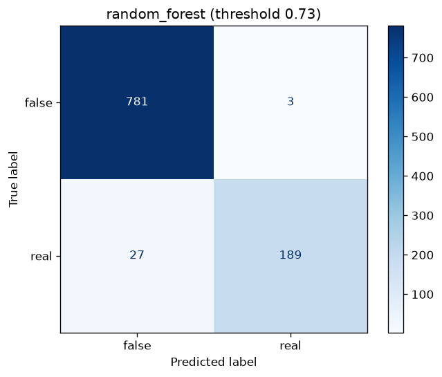
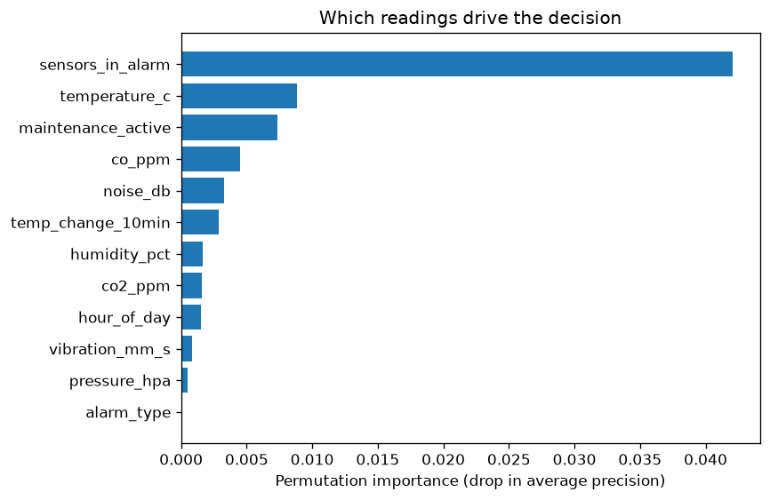

# Factory False-Alarm Prediction

Factory alarm systems (smoke, gas, temperature, humidity) fire constantly, and most
of the time nothing is wrong: steam, welding, an open door or a glitching sensor.
Operators who see too many false alarms start ignoring them, which is dangerous.

This project trains a classifier that looks at the **CO2, CO, humidity, temperature,
smoke, pressure, vibration and noise readings** around an alarm, plus context
(duration, how many sensors tripped, time of day, machine and maintenance state)
and decides whether the alarm is **real** or **false**.

## Features

- Synthetic data generator that simulates real alarms (fire, gas leak, overheating) and
  false ones (steam, welding, door opening, sensor glitch, cleaning). Replace it with your plant's logs.
- Compares Logistic Regression, Random Forest and Gradient Boosting with 5-fold cross-validation
- Handles class imbalance (real alarms are rare)
- Tunes the decision threshold on cross-validated training predictions to catch **≥ 90% of real alarms**, because a missed real alarm costs far more than a false one
- Reports: metrics JSON, confusion matrix and feature-importance plots
- CLI for generating, training and predicting; REST API (FastAPI) for serving; pytest tests

## Results (simulated data, 20% hold-out test set)

| Metric | Value |
|--------|-------|
| Best model (5-fold CV F1) | random forest |
| Test F1 (real alarm class) | 0.926 |
| Test ROC-AUC | 0.950 |
| Real alarms caught (recall) | 87.5% (189 of 216) |
| False alarms still raised | 3 of 784 (0.4%) |




About 2% of labels are deliberately flipped to mimic mislabelled logs, which caps
achievable accuracy. Correlated sensors share credit in the importance chart, so a
short bar means "redundant with another reading", not "useless".

## Structure

```text
factory-false-alarm-prediction/
├── src/false_alarm/
│   ├── config.py     # paths and feature lists
│   ├── data.py       # synthetic data generation / loading
│   ├── model.py      # preprocessing + candidate pipelines
│   ├── train.py      # model selection, threshold tuning, reports
│   ├── predict.py    # inference
│   ├── cli.py        # command line
│   └── api.py        # FastAPI service
├── data/             # alarm_events.csv (generated)
├── models/           # saved model
├── reports/          # metrics.json, plots
└── tests/
```

## Quick start

```bash
python3 -m venv .venv && source .venv/bin/activate     # Windows: .venv\Scripts\activate
pip install -r requirements.txt
export PYTHONPATH=src                                  # Windows: set PYTHONPATH=src

python -m false_alarm generate --samples 5000          # data/alarm_events.csv
python -m false_alarm train                            # models/ + reports/
python -m false_alarm predict --csv data/alarm_events.csv --out reports/predictions.csv
pytest
```

A trained model is included in `models/` (built with scikit-learn 1.9.1). Pickled models
only load reliably on the same scikit-learn version — if `predict` fails to load it,
run `python -m false_alarm train` to rebuild it (under a minute).

Classify one event:

```bash
python -m false_alarm predict --event '{"co2_ppm":2400,"co_ppm":45,"humidity_pct":38,
"temperature_c":58,"smoke_density":0.6,"pressure_hpa":1012,"vibration_mm_s":2,"noise_db":60,
"co2_change_10min":500,"temp_change_10min":9,"humidity_change_10min":-5,"smoke_change_10min":0.3,
"alarm_duration_s":240,"sensors_in_alarm":4,"hour_of_day":14,"machine_running":1,
"maintenance_active":0,"alarm_type":"smoke"}'
```

## REST API

```bash
uvicorn false_alarm.api:app --reload      # then open http://127.0.0.1:8000/docs
```

`POST /predict` with the event JSON returns `{"real_alarm_probability": 0.97, "verdict": "REAL"}`.

## Using real data

Provide a CSV with the columns listed in `src/false_alarm/config.py` (`ALL_FEATURES`)
and the target `is_real_alarm` (1 = real, 0 = false), save it as `data/alarm_events.csv`,
and run `python -m false_alarm train`. Adjust the feature lists to your sensors.

## Notes

The bundled data is simulated, so scores are optimistic. Expect lower numbers on
real plant data, where label quality matters most.
